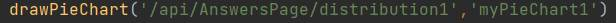
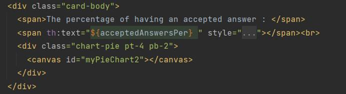
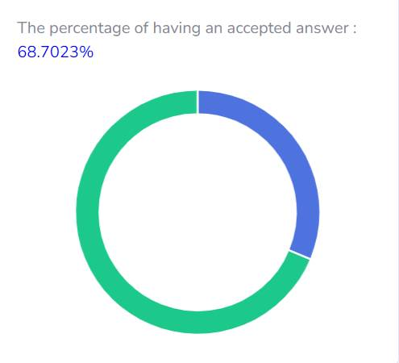
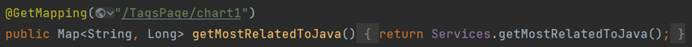
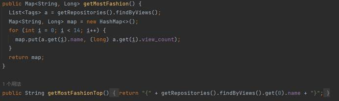
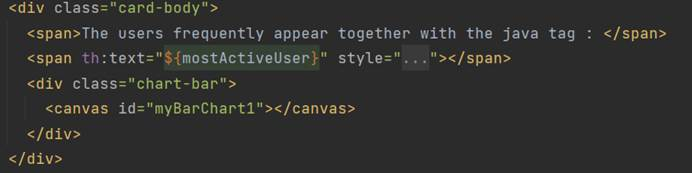

# CS209 Final Project Report

**李昱纬12112513  廖辰益12111719**

[TOC]

## Part 1 数据库结构与爬虫

本项目使用了相较于PostgreSQL更加轻量化的MySQL数据库存储数据。

### 数据库结构

为了满足本次Project的数据展示要求，本着数据库建立的"第三范式"（Third Normal Form）原则，即尽量减少在不同表之间使用外键联系，我们总共通过MySQL建立了7个表，彼此之间没有外键联系。

- **questions表**（即为thread构建的表）为最主要的表，包含了共计655条数据。在收集数据时，我们多样化地采集了赞同数、活跃度、热度不同维度的question，既有历史上的高赞问题，也有近期的问题。表中，每个非主键列都直接与主键（question_id）相关联，服务于大多数设计要求。

- **user表**记录了所有thread中所有用户，以及他们活跃的次数。

- **comments**和**answers表**的body列，记录了所有thread中评论和回答的内容，连同questions表中的body列，用于分析高级要求部分的经常讨论的 Java API，并将结果保存在了hot_api表中。
- **hot_api表**存储了每个api的名字和出现的数量。

- **tags表**记录了所有thread中的tags和tags组合，统计了它们的浏览量和点赞数，以及出现的次数。
- **tags_java_related表**统计了和java标签一起出现的tags以及次数。

数据库可视化如下：


部分数据库内容展示：


### 爬虫与建库

#### 概述

本项目使用Stack Exchange API，合法地收集了StackOverflow网站上共计655条question的数据。

由于Stack Exchange API对爬取的数据有限制（如果单次爬取的数据量过大，会被封锁ip，进而中断爬取过程，如果没有按一定顺序爬取，可能造成前功尽弃），加之项目实践初期由于学习不充分没有利用filter功能，因此，本项目采取分阶段爬取数据的策略，依次爬取及更新questions，tags，users和bodies（包括comments和answers）。

通过addData类的main函数可以看出这一点。


在实现逻辑上，共使用了两个类来完成操作，分别是addData类和StackOverflowlAPI类。后者用于处理所有向API网站发送的不同的请求并接收和封装网站返回的json格式数据，前者则通过调用它来获取数据，并负责在处理数据之后，通过java.sql库把数据插入数据库相应位置。

由于每一步的流程都很相似，因此本报告只选取第一步addQuestion()的部分讲解。

#### addData类

以下是addData类中addQuestion()方法的展示。各部分功能详见注释。

```java
static void addQuestion() {
    // 使用StackOverflowApi类的fetchData方法，向StackExchange API发送请求
    StackOverflowApi api = new StackOverflowApi();
    // 设置api请求的参数
    Map<String, String> params = new HashMap<>(1);
    params.put("pagesize", "1");
    params.put("page", "1");
    params.put("sort", "activity");
    //    params.put("sort", "votes");
    //    params.put("sort", "hot");
    params.put("order", "desc");
    params.put("tagged", "java");

    // 获得返回的JsonObject
    CompletableFuture<JsonObject> future = api.fetchData("questions", params);

    future.thenAcceptAsync(jsonObject -> {
        JsonArray items = jsonObject.getAsJsonArray("items");
        List<CompletableFuture<Void>> tasks = new ArrayList<>();

        for (int i = 0; i < items.size(); i++) {
            JsonObject item = items.get(i).getAsJsonObject();
            tasks.add(CompletableFuture.runAsync(() -> insertQuestionIntoDatabase(item, api))
                     );
        }
        CompletableFuture.allOf(tasks.toArray(new CompletableFuture<?>[0])).join();
    });
}
```

值得一提的是，为了解决api请求到接收造成的时间延迟问题、以及大量数据插入的高并发时间消耗问题，该方法使用了CompletableFuture类。它可以管理异步任务、处理任务的结果，并在任务完成后执行相应的回调函数或等待所有任务的完成。

上述代码中，`CompletableFuture<JsonObject> future`被用来存储一个异步任务的结果，即`api.fetchData("questions", params)`方法返回的对象，表示从StackExchange API获取问题数据的异步任务。

接下来，使用`future.thenAcceptAsync()`方法注册一个回调函数，该函数会在异步任务完成时被执行。回调函数以获取到的`JsonObject`为参数，进一步处理其中的数据。

在回调函数中，首先从`JsonObject`中获取到问题数据的数组`items`，然后遍历每个问题，使用`CompletableFuture.runAsync()`方法创建一个异步任务，将问题的`JsonObject`和`api`对象作为参数传递给`insertQuestionIntoDatabase`方法。由于是异步执行，可以提高处理速度。

通过将这些异步任务添加到`tasks`列表中，可以在后续使用`CompletableFuture.allOf()`方法等待所有任务完成。`CompletableFuture.allOf()`方法接受一个`CompletableFuture<?>`数组，并返回一个新的`CompletableFuture<Void>`对象，它表示所有任务都已完成。最后，通过调用`.join()`方法等待所有任务的完成。


#### insertQuestionIntoDatabase()方法

这段方法用于从StackExchange API获取的问题数据插入到数据库中。

具体步骤如下：

1. 构建了一个INSERT SQL语句，用于向数据库表"questions"插入数据
2. 获取到传入方法的问题数据的JsonObject对象，并从中提取出需要插入到数据库的字段值
3. 通过JDBC连接数据库，使用`DriverManager.getConnection()`方法建立数据库连接
4. 创建一个`PreparedStatement`对象，用于执行预编译的SQL语句
5. 将问题数据的字段值设置到`PreparedStatement`对象中，使用`setXXX()`方法指定字段的索引和对应的值
6. 将问题的标签转换为字符串，并设置到`PreparedStatement`对象的对应字段中
7. 如果问题被回答过（is_answered为true），则设置被接受的回答的ID到`PreparedStatement`对象的相应字段中
8. 使用`executeUpdate()`方法执行SQL语句，将数据插入到数据库中

```java
private static void insertQuestionIntoDatabase(JsonObject jsonObject, StackOverflowApi api) {
    String sql = "INSERT INTO questions (question_id, answer_count, is_answered, creation_date, accepted_answer_id, accepted_date, not_public_will, score, view_count, tags) VALUES (?, ?, ?, ?, ?, ?, ?, ?, ?, ?)";

    try (Connection conn = DriverManager.getConnection(DB_URL, USER, PASS)) {
        // 将信息填入sql语句
        PreparedStatement pstmt = conn.prepareStatement(sql);
        pstmt.setInt(1, jsonObject.get("question_id").getAsInt());
        pstmt.setInt(2, jsonObject.get("answer_count").getAsInt());
        boolean is_answered = jsonObject.get("is_answered").getAsBoolean();
        pstmt.setBoolean(3, is_answered);
        Date date = new Date(jsonObject.get("creation_date").getAsLong() * 1000);
        Timestamp timestamp = new Timestamp(date.getTime());
        pstmt.setTimestamp(4, timestamp);

        pstmt.setNull(5, java.sql.Types.INTEGER);
        pstmt.setNull(6, java.sql.Types.TIMESTAMP);
        pstmt.setNull(7, java.sql.Types.BOOLEAN);

        pstmt.setInt(8, jsonObject.get("score").getAsInt());
        pstmt.setInt(9, jsonObject.get("view_count").getAsInt());

        // 获取问题的标签
        JsonArray tags = jsonObject.get("tags").getAsJsonArray();
        // 将标签转换为字符串
        String tagsString = tags.toString();
        pstmt.setString(10, tagsString);

        if (is_answered) {
            int acceptedAnswerId = jsonObject.get("accepted_answer_id").getAsInt();
            pstmt.setInt(5, acceptedAnswerId);
        }

        pstmt.executeUpdate();
        System.out.println("Record inserted successfully");
    } catch (SQLException e) {
        e.printStackTrace();
    }
}
```


#### StackOverflowlAPI类

该类包含以下功能：

1. 构建请求URL：根据传入的操作类型（op）和参数（params），构建对应的API请求URL。

   ```java
   HttpUrl url = null;
   switch (op) {
       case "questions":
           if (params.containsKey("ids")) {
               int questionId = Integer.parseInt(params.get("ids"));
               params.remove("ids"); // 删除params中的ids参数
               urlPath = String.format("/questions/%d", questionId); // 将id插入到URL路径中
           } else {
               urlPath = "/questions";
           }
           url = HttpUrl.parse(API_BASE_URL + urlPath)
               .newBuilder()
               .addQueryParameter("site", "stackoverflow")
               .addQueryParameter("key", API_KEY)
               .build();
           break;
           //... ...
   }
   for (Map.Entry<String, String> entry : params.entrySet()) {
       url = url.newBuilder().addQueryParameter(entry.getKey(), entry.getValue()).build();
   }
   ```

   根据api的手册，id的数据实际上不是作为参数出现在链接的最后面（例如： /questions?ids=564），而是将问题ID直接嵌入到URL路径中（例如：/questions/564）。因此，需要对`params`中的`ids`参数做出一些调整。

2. 发送异步请求：使用OkHttp库发送异步请求，获取Stack Overflow API的响应。

3. 解析响应数据：在请求的回调函数中，对API响应进行解析和处理。

4. 返回结果：将解析后的响应数据封装为`CompletableFuture<JsonObject>`对象，作为异步任务的结果返回

   ```java
   // 创建请求
   Request request = new Request.Builder()
       .url(url)
       .build();
   
   // 发送请求并处理响应
   HttpUrl finalUrl = url;
   
   client.newCall(request).enqueue(new Callback() {
       @Override
       public void onFailure(Call call, IOException e) {
           e.printStackTrace();
           future.completeExceptionally(e);
       }
   
       @Override
       public void onResponse(Call call, Response response) throws IOException {
           if (!response.isSuccessful()) {
               throw new IOException("Unexpected code " + response);
           } else {
               String jsonData = response.body().string();
               // 使用 Gson 解析 JSON 数据
               JsonObject jsonObject = gson.fromJson(jsonData, JsonObject.class);
               System.out.println(finalUrl);
               System.out.println(jsonObject);
               future.complete(jsonObject);
           }
       }
   });
   ```

   


## Part 2 项目架构结构设计


以下是我们项目java部分的结构：


 

###controller目录

- **DemoController类**是SpringBoot框架的Controller，在访问页面时返回相应的视图


- **DataRestController类**是SpringBoot框架的RestController，用于处理前端发送的请求


- **GlobalExceptionHandler类**用于全局异常处理，如果在前端操作时，触发了后端的错误（如500：内部错误）会抛出相关异常，而不是直接终止运行


 

### databsase目录

- **adddata类**用于数据库数据的爬取，并把数据储存在数据库里（建库）。


 

### model目录

- **HotApi类**与数据库中的hot_api表对应
- **Questions类**与数据库中的questions表对应
- **Tags类**与数据库中的tags表对应
- **TagsJavaRelated类**与数据库中的tags_java_related表对应
- **Users类**与数据库中的users表对应
- **Answers类**与数据库中的answers表对应
- **Comments类**与数据库中的comments表对应

 

### repository目录

- **Repositories接口**继承JpaRepository，用于查询数据库各表中的数据。


 

### service目录

- **Services类**用于处理各种事务，里面的各方法处理从数据库获取的数据，然后被RestController调用。


 

- **Application类**用于启动整个SpringBoot框架，让所有程序开始运行。


 

- **StackOverflowApi类**定义了一些从网站上爬取数据的方法，在adddata类中使用。


 

### resources目录

- **static目录**用于存储html页面所需的各种静态资源，包括html文件使用的css、scss来定义网页的样式和布局，绘制图表时使用的js文件库，网页上的图标文件等。

  

- **template目录**下是不同页面对应的html文件

  - Homepage.html展现的是主页面
  - Answerspage.html展现与答案相关数据的页面
  - Tagspage.html展现与标签相关数据的页面
  - Userspage.html展现与用户相关数据的页面
  - Apispage.html展现与Api相关数据的页面


## Part 3 成果与代码片段展示

我们的可视化方式有三种：环状图、柱状图、单词云。每种可视化的方式都有相应的方法进行绘制。

- **环状图**的方法如下，path为前端发送请求到达的路径，chartId表明要绘制的哪个数据图。


 

- **柱状图**的方法如下，柱状图的排序方式均设置为从大到小，path为前端发送请求到达的路径，chartId表明要绘制的哪个数据图，max表示y轴最大值。


 

- **单词云**的方法如下,path为前端发送请求到达的路径，cloudId表明要绘制的哪个数据图。


 

### Numbers of Answers部分

#### 展示没有answers的百分比

- **前端**发送请求调用后端的代码或函数如下，第一个是百分比，第二个是环状图。

		 


- 对应的**ModelAndView**方法如下


 

- 对应的**RestController**方法如下


 

- 相关的**Services**方法如下


 

- 相关的**Repositories**数据库查询方法如下


 

- **网页**展现的结果如下


 

#### 展示answers数量的最大值和平均值

- **前端**发送请求调用后端的代码或函数如下，第一个是最大值，第二个是平均值。


 

- 对应的**ModelAndView**方法如下


 

- 相关的**Services**方法如下


 

- 相关的**Repositories**数据库查询方法如下


 

- **网页**展现的结果如下


 

#### 展示answers数的分布

- **前端**发送请求调用后端的代码或函数如下。



 

- 对应的**RestController**方法如下


 

- 相关的**Services**方法如下，将Answer数划分为7个范围，统计每个范围的数量。


 

- 相关的**Repositories**数据库查询方法如下


 

- **网页**展现的结果如下

 


 

### Accepted Answers部分

#### 展示有accepted answer的百分比

- **前端**发送请求调用后端的代码或函数如下，第一个是百分比，第二个是环状图。




 

- 对应的**ModelAndView**方法如下


 

- 对应的**RestController**方法如下


 

- 相关的**Services**方法如下


 

- 相关的**Repositories**数据库查询方法如下


 

- **网页**展现的结果如下

 



 

#### 展示问题从提出到解决时间间隔的分布

- **前端**发送请求调用后端的代码或函数如下


- 对应的**RestController**方法如下


 

- 相关的**Services**方法如下，分为七个部分，有六个部分是按时间范围划分，还有一个部分是记录未解决问题的数量。


 

- 相关的**Repositories**数据库查询方法如下


 

- **网页**展现的结果如下

 


 

#### 展示含有 non-accepted answer 的 upvote 数高于 accepted answer 的问题的百分比

- **前端**发送请求调用后端的代码或函数如下，第一个是百分比，第二个是环状图。


 

- 对应的**ModelAndView**方法如下


 

- 对应的**RestController**方法如下


 

- 相关的**Services**方法如下


 

- 相关的**Repositories**数据库查询方法如下


 

- **网页**展现的结果如下

 


 

### Tags部分

####  展示哪些 tags 经常和 Java tag 一起出现 

- **前端**发送请求调用后端的代码或函数如下，第一个是tag，第二个是柱状图,第三个是单词云。


 

- 对应的**ModelAndView**方法如下


 

- 对应的**RestController**方法如下




 

- 相关的**Services**方法如下，按降序获取了前50条数据。


 

- 相关的**Repositories**数据库查询方法如下


 

- **网页**展现的结果如下

 


 

#### 展示哪些 tags 或 tag 的组合得到最多的 upvotes 

- **前端**发送请求调用后端的代码或函数如下，第一个是tag 或 tags 的组合，第二个是柱状图。


 

- 对应的**ModelAndView**方法如下


 

- 对应的**RestController**方法如下


 

- 相关的**Services**方法如下，按降序获取了前14条数据。


 

- 相关的**Repositories**数据库查询方法如下


 

- **网页**展现的结果如下

 


#### 展示哪些 tags 或 tag 的组合得到最多的 views 

- **前端**发送请求调用后端的代码或函数如下，第一个是tag 或 tags 的组合，第二个是柱状图。


 

- 对应的**ModelAndView**方法如下


 

- 对应的**RestController**方法如下


 

- 相关的**Services**方法如下，按降序获取前14条数据。




 

- 相关的**Repositories**数据库查询方法如下


 

- **网页**展现的结果如下


 

### Users部分

#### 展示参与 Thread 讨论的用户数量的分布 

- **前端**发送请求调用后端的代码或函数如下


 

- 对应的**RestController**方法如下


 

- 相关的**Services**方法如下，按照用户数量（在一个Thread里相同的用户只记录一次）分为7个范围。


 

- 相关的**Repositories**数据库查询方法如下


 

- **网页**展现的结果如下


 

#### 从问题回答者和评论者两个角度进行统计 

- **前端**发送请求调用后端的代码或函数如下，第一个是answer方面的环状图，第二个是comment方面的环状图。


 

- 对应的**RestController**方法如下


 

- 相关的**Services**方法如下，按照用户数量（在一个Thread里相同的用户只记录一次），在**answer**方面分为7个范围，在**comment**方面分为4个范围。


 

- 相关的**Repositories**数据库查询方法如下


 

- **网页**展现的结果如下


#### 展示哪些用户参与 java thread 讨论最活跃 

- **前端**发送请求调用后端的代码或函数如下，第一个是用户，第二个是柱状图。




 

- 对应的**ModelAndView**方法如下


 

- 对应的**RestController**方法如下


 

- 相关的**Services**方法如下，按降序获取前14条数据。


 

- 相关的**Repositories**数据库查询方法如下


 

- **网页**展现的结果如下


 

#### Frequently discuss Java Apis部分

- **前端**发送请求调用后端的代码或函数如下，第一个是Api，第二个是柱状图，第三个是单词云。


 

- 对应的**ModelAndView**方法如下


 

- 对应的**RestController**方法如下


 

- 相关的**Services**方法如下，按降序获取前45条数据。


 

- 相关的**Repositories**数据库查询方法如下


 

- **网页**展示哪些 Java APIs 在 Stack Overflow 上最频繁被讨论


 

## Part 4 总结分析

